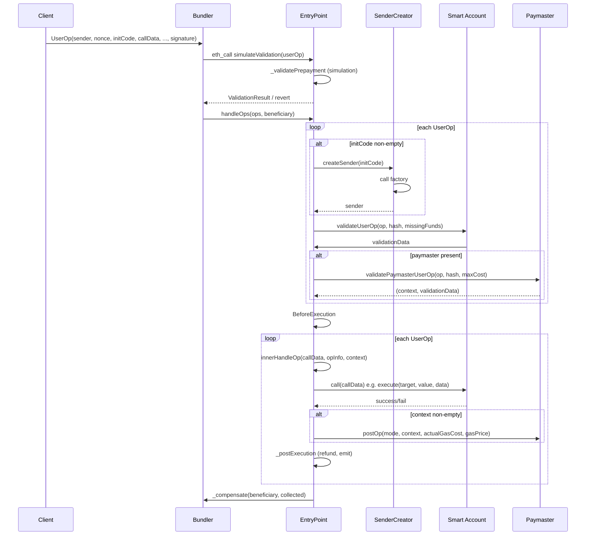
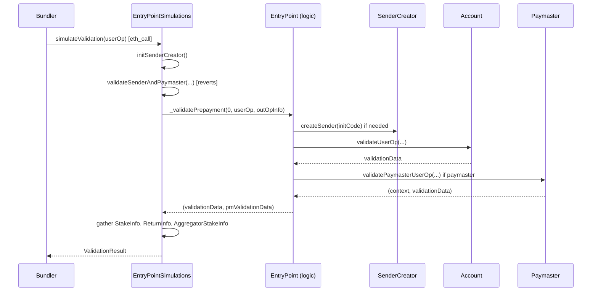
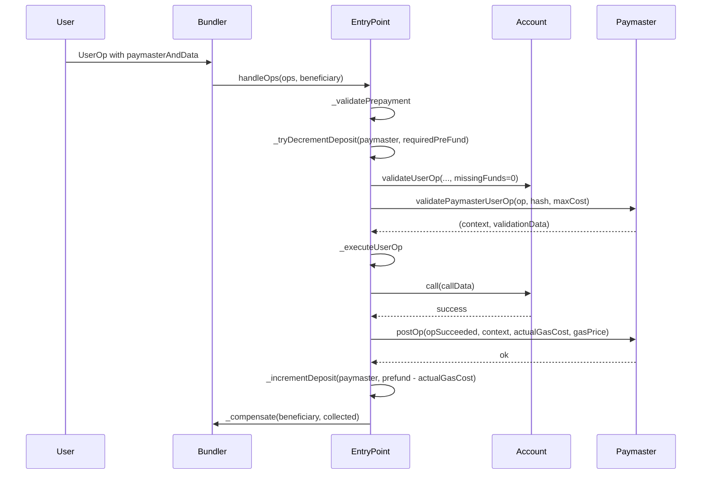
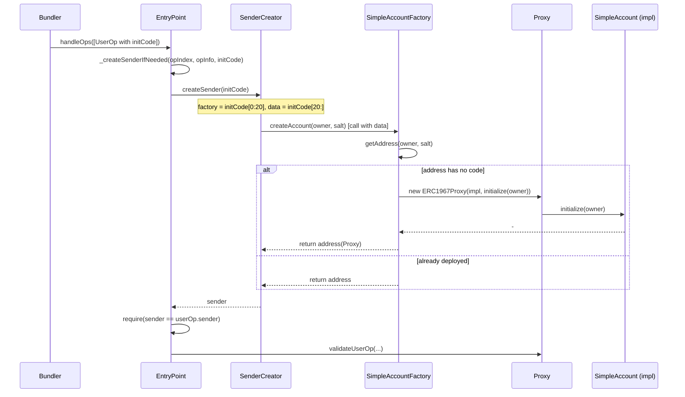

# eth-infinitism/account-abstraction 源码分析报告

> 目标读者：有 Solidity 基础、想真正理解 ERC-4337 实现原理的工程师。  
> 基于仓库当前代码（EntryPoint v0.9 / PackedUserOperation 等）进行分析。

---

## 一、项目定位与设计目标

### 1.1 仓库在 ERC-4337 中扮演什么角色

本仓库是 **ERC-4337 的链上参考实现与官方合约库**，主要提供：

- **单例 EntryPoint**：每条链部署一份，是处理 UserOperation 的唯一切入点。
- **规范实现**：EntryPoint、StakeManager、NonceManager、UserOperation 结构等与 EIP-4337 规范对齐，被 Bundler、各 AA 钱包和 Paymaster 共同依赖。
- **可复用基类与示例**：BaseAccount、BasePaymaster、SimpleAccount、SimpleAccountFactory 等，供项目集成或二次开发。

因此，它解决的是「**链上如何验证并执行 UserOperation**」以及「**如何实现合规的 Account / Paymaster**」的问题，而不是 Bundler、客户端 SDK 或完整钱包产品。

### 1.2 解决了什么问题

- **账户抽象**：用户用智能合约账户（Smart Account）发起操作，不再依赖 EOA 私钥直接签名交易。
- **统一入口**：所有 UserOperation 经 EntryPoint 进入，验证、执行、扣费、退款逻辑集中且可审计。
- **Gas 代付**：Paymaster 可为用户代付 gas，结合 deposit/stake 和 postOp 做结算与风控。
- **批量与聚合**：支持 `handleOps` 批量执行、`handleAggregatedOps` 聚合签名，便于 Bundler 打包。

### 1.3 与传统 EOA 模型的区别

| 维度       | EOA 模型                    | ERC-4337（本仓库）                         |
|------------|-----------------------------|--------------------------------------------|
| 交易入口   | 用户 EOA 直接发 tx          | Bundler 发 tx 调用 EntryPoint.handleOps   |
| 验证与执行 | 由协议层（ECDSA + nonce）   | 由 EntryPoint + Account 合约（validateUserOp + callData） |
| Gas 支付   | 从 EOA 扣 ETH               | 从 Account 的 deposit 或 Paymaster 的 deposit 扣 |
| 账户形态   | 外部账户（私钥）            | 智能合约账户（可自定义验证与执行逻辑）     |

### 1.4 与「AA = ERC-4337」的关系

- **Account Abstraction（AA）** 是「用智能合约账户替代 EOA 作为操作主体」的抽象概念。
- **ERC-4337** 是在不改以太坊协议的前提下，通过「UserOperation + EntryPoint + Bundler」实现 AA 的一套标准；本仓库是这条标准在链上的**核心实现**。
- 因此：**AA 是目标，ERC-4337 是实现路径之一**；本仓库是 ERC-4337 链上侧的「规范实现 + 参考代码」，而不是「AA 的全部」。

---

## 二、仓库结构总览

### 2.1 主要目录说明

```
contracts/
├── core/           # 核心逻辑：EntryPoint、验证、gas、nonce、stake、创建 sender
├── accounts/       # 示例账户与工厂
├── interfaces/     # IEntryPoint、IAccount、IPaymaster、PackedUserOperation 等
├── legacy/         # v0.6 兼容接口
├── test/           # 测试合约（含各种 Paymaster/Account 变体）
└── utils/          # Exec 等工具
```

### 2.2 核心合约列表

| 合约 | 路径 | 作用 |
|------|------|------|
| EntryPoint | `core/EntryPoint.sol` | 处理 UserOperation：验证、执行、扣费、退款 |
| EntryPointSimulations | `core/EntryPointSimulations.sol` | 仅用于 eth_call 的 simulateValidation / simulateHandleOp |
| BaseAccount | `core/BaseAccount.sol` | Account 基类：validateUserOp、execute、executeBatch |
| SimpleAccount | `accounts/SimpleAccount.sol` | 单 owner、ECDSA 签名的示例账户 |
| SimpleAccountFactory | `accounts/SimpleAccountFactory.sol` | 基于 Create2 的账户工厂 |
| BasePaymaster | `core/BasePaymaster.sol` | Paymaster 基类：validatePaymasterUserOp、postOp |
| StakeManager | `core/StakeManager.sol` | deposit/stake 管理（混入 EntryPoint） |
| NonceManager | `core/NonceManager.sol` | nonce 序列管理（混入 EntryPoint） |
| SenderCreator | `core/SenderCreator.sol` | 由 EntryPoint 调用的「中性地址」部署账户 |
| UserOperationLib | `core/UserOperationLib.sol` | UserOperation 编码、哈希、解包 |
| Helpers | `core/Helpers.sol` | 常量、ValidationData 打包/解析、calldataKeccak 等 |

### 2.3 测试、部署脚本、接口、辅助库的作用

- **test/**：覆盖 EntryPoint、Account、Paymaster、Factory、Stake、Nonce、simulateValidation 等；含 MaliciousAccount、各种 Paymaster（AcceptAll、WithSig、WithPostOp）用于边界与攻击面测试。
- **interfaces/**：定义 IEntryPoint、IAccount、IPaymaster、PackedUserOperation、IStakeManager、INonceManager、ISenderCreator、IAccountExecute、IEntryPointSimulations 等，供实现方与链下 Bundler/SDK 对齐。
- **utils/Exec.sol**：封装 `call`/`staticcall`/`delegatecall` 与 `getReturnData`/`revertWithReturnData`，统一调用方式与错误处理。

### 2.4 建议阅读顺序

1. **PackedUserOperation**（`interfaces/PackedUserOperation.sol`）→ **UserOperationLib**（`core/UserOperationLib.sol`）：理解 UserOp 字段与哈希。
2. **IEntryPoint**（`interfaces/IEntryPoint.sol`）→ **EntryPoint**（`core/EntryPoint.sol`）：理解入口、事件与错误码。
3. **StakeManager**、**NonceManager**（`core/`）：理解 deposit、stake、nonce。
4. **BaseAccount** → **SimpleAccount** → **SimpleAccountFactory**：理解账户验证与创建。
5. **BasePaymaster** + 测试 Paymaster：理解代付与 postOp。
6. **EntryPointSimulations**：理解 simulateValidation / simulateHandleOp 与 Bundler 的配合。
7. **SenderCreator**、**Eip7702Support**：理解账户创建与 7702 扩展。

---

## 三、核心架构图（文字版）

- **UserOperation**：用户操作的「意图」包，包含 sender、nonce、initCode、callData、gas 参数、paymasterAndData、signature；由 Bundler 收集并提交给 EntryPoint。
- **Bundler**：链下角色，负责运行 EntryPointSimulations.simulateValidation、打包 UserOp、以 EOA 调用 `EntryPoint.handleOps(ops, beneficiary)`，并承担链上 gas，从 EntryPoint 的 `_compensate` 收回费用。
- **EntryPoint**：单例合约；执行 `handleOps` 时依次对每个 UserOp 做验证阶段（含创建 sender、验证账户、nonce、Paymaster）和执行阶段（对 sender 执行 callData、postOp、结算 gas、退款）；持有 StakeManager + NonceManager 逻辑。
- **Smart Account**：由 UserOp.sender 指定；实现 `validateUserOp`（验签、可选 nonce 规则、向 EntryPoint 补足 prefund）；执行阶段被 EntryPoint 用 callData 调用（通常是 execute/executeBatch 或 executeUserOp）。
- **Paymaster**：可选；在验证阶段通过 `validatePaymasterUserOp` 同意代付并返回 context；执行阶段后若 context 非空则被调用 `postOp`；其 deposit 被 EntryPoint 扣减 prefund，多退少不补（少则 UserOp 失败）。
- **Factory**：出现在 initCode 中（factory || factoryCalldata）；由 SenderCreator 在「中性地址」调用，必须返回 `sender`；用于 counterfactual 地址与首次部署。
- **Aggregator**：仅在 `handleAggregatedOps` 路径使用；账户可返回聚合器地址，由 EntryPoint 先调用 `aggregator.validateSignatures(ops, signature)` 再继续验证。
- **StakeManager**：维护每个 account 的 deposit（用于 prefund 扣减与退款）和可选的 stake（锁定 + unstakeDelay，用于信任/抗 DoS）。
- **NonceManager**：按 (sender, key) 维护序列号，`_validateAndUpdateNonce(sender, nonce)` 保证一次一用。
- **SenderCreator**：独立合约，仅被 EntryPoint 调用；用 UserOp.initCode 调用 factory，得到 sender，避免 EntryPoint 自身作为创建者带来的语义与安全边界问题。

---

## 四、核心合约逐个分析

### 4.1 EntryPoint

- **作用**：处理 UserOperation 的唯一切入点；协调验证、执行、prefund 扣减、退款与补偿。
- **关键状态**：无持久化业务状态；使用 `currentUserOpHash`（transient）、immutable `_senderCreator`、继承的 StakeManager/NonceManager 的 mapping。
- **核心函数**：`handleOps` / `handleAggregatedOps`、`getUserOpHash`、`getSenderAddress`、内部 `_validatePrepayment`、`_executeUserOp`、`innerHandleOp`、`_postExecution`、`_compensate`。
- **关系**：调用 StakeManager/NonceManager 的 deposit/nonce 逻辑；通过 SenderCreator 创建 sender；调用 Account.validateUserOp、Paymaster.validatePaymasterUserOp 与 postOp。
- **权限**：无 onlyOwner；通过 `nonReentrant`（要求 `tx.origin == msg.sender && msg.sender.code.length == 0`）防止重入与合约直接调 handleOps。
- **设计意图**：验证与执行分离、prefund 先扣再执行、多退少不补、gas 惩罚与事件齐全，便于 Bundler 与索引。
- **风险点**：EntryPoint 是绝对信任核心；升级需全网共识；内存与 gas 边界需严格测试（见后文安全分析）。

### 4.2 BaseAccount

- **作用**：实现 IAccount，提供 validateUserOp 框架（校验调用方为 EntryPoint、验签、nonce、补 prefund）以及 execute/executeBatch。
- **关键状态**：无自身状态；子类如 SimpleAccount 存 owner。
- **核心函数**：`validateUserOp`、`execute`、`executeBatch`、`_validateSignature`（抽象）、`_validateNonce`、`_payPrefund`、`_requireFromEntryPoint`。
- **关系**：被 EntryPoint 调用 validateUserOp；子类实现 _validateSignature；execute 由 EntryPoint 通过 callData 间接调用。
- **权限**：execute/executeBatch 通过 `_requireForExecute` 限制为 EntryPoint（子类可放宽为 owner）。
- **设计意图**：统一验证流程与执行接口，便于扩展多签、社交恢复等。
- **风险点**：子类必须正确实现 _validateSignature 与 nonce 策略，否则存在伪造或重放风险。

### 4.3 SimpleAccount

- **作用**：单 owner、ECDSA 签名的示例账户；支持 execute、executeBatch、deposit/withdraw、UUPS 升级。
- **关键状态**：`owner`（address）、immutable `_entryPoint`。
- **核心函数**：`validateUserOp`（继承）、`_validateSignature`（ECDSA.recover）、`execute`/`executeBatch`（继承）、`initialize`、`addDeposit`/`withdrawDepositTo`。
- **关系**：依赖 BaseAccount、TokenCallbackHandler、UUPSUpgradeable；通过 entryPoint() 与 EntryPoint 交互。
- **权限**：仅 EntryPoint 可触发 validateUserOp 与 execute；onlyOwner 用于 withdrawDepositTo、升级。
- **设计意图**：最小可运行示例，便于集成与教学。
- **风险点**：单签、无时间窗口等高级策略；owner 泄露即账户失控。

### 4.4 SimpleAccountFactory

- **作用**：根据 owner + salt 用 Create2 部署 SimpleAccount 代理，返回确定地址；供 getSenderAddress 与首次 UserOp 的 initCode 使用。
- **关键状态**：immutable `accountImplementation`、`senderCreator`。
- **核心函数**：`createAccount(owner, salt)`、`getAddress(owner, salt)`。
- **关系**：仅被 SenderCreator（即 EntryPoint 委托）调用 createAccount；getAddress 可被链下/链上只读调用。
- **权限**：createAccount 仅允许 `msg.sender == senderCreator`。
- **设计意图**：counterfactual 地址可预测，用户可先存 ETH 再部署。
- **风险点**：implementation 或 init 逻辑恶意会波及所有新账户；salt 碰撞理论上存在但实践中可忽略。

### 4.5 BasePaymaster

- **作用**：实现 IPaymaster，校验调用方为 EntryPoint，提供 validatePaymasterUserOp/postOp 框架与 deposit/withdraw。
- **关键状态**：immutable `_entryPoint`；继承 Stakeable（Ownable）。
- **核心函数**：`validatePaymasterUserOp`、`postOp`、`_validatePaymasterUserOp`（抽象）、`_postOp`（默认 revert）、`deposit`、`withdrawTo`、`_requireFromEntryPoint`。
- **关系**：被 EntryPoint 调用验证与 postOp；通过 EntryPoint.depositTo 充值。
- **权限**：仅 EntryPoint 可调 validate/postOp；onlyOwner 可 withdraw。
- **设计意图**：统一 Paymaster 接口与安全边界，便于实现代付、配额、链下签名等。
- **风险点**：子类若在 _validatePaymasterUserOp 中做重状态变更，可能被 Bundler 拒绝；postOp 若 revert 会拖垮整笔 UserOp。

### 4.6 VerifyingPaymaster

- **说明**：本仓库**未**提供名为 VerifyingPaymaster 的合约；仅有 BasePaymaster 与测试用 Paymaster（如 TestPaymasterAcceptAll、TestPaymasterWithSig、TestPaymasterWithPostOp）。需要「验证型」Paymaster 时需自行继承 BasePaymaster 实现。

### 4.7 StakeManager

- **作用**：管理 deposit（余额式 prefund）与 stake（锁定 + unstakeDelay）；EntryPoint 继承它，故 deposit 存在 EntryPoint 上。
- **关键状态**：`mapping(address => DepositInfo) private deposits`（deposit、stake、unstakeDelaySec、withdrawTime 等）。
- **核心函数**：`depositTo`、`withdrawTo`、`balanceOf`、`addStake`、`unlockStake`、`withdrawStake`、`_incrementDeposit`、`_tryDecrementDeposit`。
- **关系**：被 EntryPoint 在验证/执行阶段扣减与退还 deposit。
- **权限**：任何人可 depositTo 任意 account；仅 account 自身可 withdrawTo/addStake/unlockStake/withdrawStake。
- **设计意图**：deposit 用于 gas 支付与退款；stake 用于 Bundler/Paymaster 信任与 DoS 缓解。
- **风险点**：withdrawTo 无延迟，恶意账户可抽走 deposit 导致后续 UserOp 失败；stake 逻辑需与业务策略一致。

### 4.8 NonceManager

- **作用**：按 (sender, key) 维护递增 nonce，保证每个 (sender, key) 下 UserOp 仅能被接受一次。
- **关键状态**：`mapping(address => mapping(uint192 => uint256)) public nonceSequenceNumber`。
- **核心函数**：`getNonce(sender, key)`、`incrementNonce(key)`、`_validateAndUpdateNonce(sender, nonce)`（内部，验证并自增）。
- **关系**：EntryPoint 在 _validatePrepayment 中调用 _validateAndUpdateNonce。
- **权限**：getNonce 只读；incrementNonce 由 msg.sender 为自己增；_validateAndUpdateNonce 仅 EntryPoint 内部使用。
- **设计意图**：支持多 key（如多会话、多设备）与顺序/乱序策略（由 nonce 高低位语义决定）。
- **风险点**：key 与序列号由账户自己选择，需防重放与 front-running。

### 4.9 SenderCreator

- **作用**：在「非 EntryPoint」的地址执行 initCode，调用 factory 创建 sender并返回，避免以 EntryPoint 为 creator 的副作用。
- **关键状态**：immutable `entryPoint`（部署时 msg.sender）。
- **核心函数**：`createSender(initCode)`、`initEip7702Sender(sender, initCallData)`。
- **关系**：仅被 EntryPoint 调用；createSender 内用 initCode[:20] 为 factory，initCode[20:] 为 calldata 调用。
- **权限**：仅 entryPoint 可调。
- **设计意图**：创建账户的上下文与 EntryPoint 解耦，符合规范且便于审计。
- **风险点**：factory 与 initCode 来自 UserOp，需防恶意 factory 或耗光 verificationGasLimit。

---

## 五、核心函数逐个拆解

### 5.1 handleOps

- **作用**：批量执行 UserOperation，先全量验证再执行，最后一次性补偿 beneficiary。
- **输入**：`ops: PackedUserOperation[]`、`beneficiary: address payable`。
- **核心逻辑**：`nonReentrant`；构建 `UserOpInfo[]`；`_iterateValidationPhase(ops, opInfos, address(0), 0)` 对每个 op 执行 _validatePrepayment 并校验 validationData；发 `BeforeExecution`；对每个 op 调用 `_executeUserOp` 累加 collected；`_compensate(beneficiary, collected)`。
- **外部调用**：通过 _validatePrepayment → Account、Paymaster、SenderCreator；通过 _executeUserOp → Account（callData）、Paymaster（postOp）；最后 beneficiary.call{value}。
- **状态变化**：StakeManager 的 deposit 扣减/增加、NonceManager 的 nonce 递增、beneficiary 余额增加。
- **revert**：验证阶段任一步失败（FailedOp/FailedOpWithRevert 等）；执行阶段 postOp 失败等；compensate 失败。
- **风险点**：单笔失败会导致整批 revert（设计如此）；gas 限值若不足会 AA95 out of gas。
- **审计关注**：验证与执行顺序、revert 传播、collected 与 refund 的数值一致性。

### 5.2 _validatePrepayment

- **作用**：对单条 UserOp 完成：拷贝到 MemoryUserOp、计算 userOpHash、校验 gas 字段上界、算 requiredPrefund、验证账户（含创建 sender）、校验并更新 nonce、验证 Paymaster（若有）、写 opInfo。
- **输入**：`opIndex`、`userOp`、`outOpInfo`（空结构体，被填充）。
- **核心逻辑**：`_copyUserOpToMemory`；`getUserOpHash(userOp)`；gas 值 require ≤ type(uint120).max；`_validateAccountPrepayment`（内部会 _createSenderIfNeeded、_callValidateUserOp、无 Paymaster 时 _tryDecrementDeposit(sender, requiredPrefund)）；`_validateAndUpdateNonce`；若有 paymaster 则 `_validatePaymasterPrepayment`（先 _tryDecrementDeposit(paymaster)、再 _callValidatePaymasterUserOp）；写 contextOffset、preOpGas。
- **外部调用**：SenderCreator.createSender、Account.validateUserOp、Paymaster.validatePaymasterUserOp。
- **状态变化**：Nonce 递增；无 Paymaster 时 sender 的 deposit 扣减；有 Paymaster 时 paymaster 的 deposit 扣减。
- **revert**：initCode 失败、validateUserOp 失败或返回格式错误、nonce 无效、验证 gas 超限、Paymaster 验证失败或格式错误等。
- **风险点**：验证顺序必须与 EIP 一致；Paymaster 先扣 deposit 再验证，若验证 revert 需保证状态一致（当前实现为 revert 整体）。
- **审计关注**：prefund 扣减时机、nonce 更新时机、gas 限制检查是否覆盖所有路径。

### 5.3 _executeUserOp

- **作用**：对已通过验证的 UserOp 执行 callData 并做 postOp 与结算。
- **输入**：`opIndex`、`userOp`、`opInfo`。
- **核心逻辑**：设置 `currentUserOpHash`；若 callData 以 `executeUserOp` 的 selector 开头则构造对 `innerHandleOp(executeUserOp, opInfo, context)` 的调用，否则构造 `innerHandleOp(callData, opInfo, context)`；用 `call(gas(), address(), 0, ...)` 调用自身；根据返回/revert 处理成功、AA95、prefund 不足、postOp revert 等，调用 `_postExecution` 并可能 emit 事件。
- **外部调用**：通过 innerHandleOp 内部对 sender 的 call(callData)、对 Paymaster 的 postOp。
- **状态变化**：由 _postExecution 对 refundAddress（sender 或 paymaster）增加 deposit、发 UserOperationEvent 等。
- **revert**：inner 返回 INNER_OUT_OF_GAS 或 INNER_REVERT_LOW_PREFUND 时按规范 revert 或结算。
- **风险点**：call 转发给 Account，Account 任意逻辑；postOp revert 会令整笔失败。
- **审计关注**：call 的 gas 传递、postOp 的 gas 限制、actualGasCost 与 refund 计算。

### 5.4 simulateValidation

- **作用**：在 EntryPointSimulations 中，供 Bundler 通过 eth_call 模拟一次验证，不改变链上状态（因会 revert）；返回 ValidationResult（preOpGas、prefund、validationData、stake 信息等）。
- **输入**：`userOp: PackedUserOperation`。
- **核心逻辑**：`_simulationOnlyValidations(userOp)`（initSenderCreator、validateSenderAndPaymaster 等）；`_validatePrepayment(0, userOp, outOpInfo)`；从 opInfo 和 paymaster/sender/factory 取 StakeInfo；组装 ReturnInfo、AggregatorStakeInfo；返回 ValidationResult。
- **外部调用**：与 handleOps 路径相同的 _validatePrepayment 内部调用（但 EntryPointSimulations 重写了 depositTo 等以增加 gas 防止仿真与真实差异）。
- **状态变化**：无持久化；内存与临时状态在 eth_call 结束后丢弃。
- **revert**：validateSenderAndPaymaster 会故意 revert 以统一冷热存储；其他与 _validatePrepayment 相同。
- **风险点**：仿真与真实执行在 gas 与存储上的差异；Bundler 必须校验返回的 aggregator 与 stake。
- **审计关注**：与真实 EntryPoint 的 _validatePrepayment 一致性、depositTo 的 gas 惩罚是否足够。

### 5.5 getUserOpHash

- **作用**：计算 UserOperation 的 EIP-712 哈希，供账户验签。
- **输入**：`userOp: PackedUserOperation`（calldata）。
- **核心逻辑**：`MessageHashUtils.toTypedDataHash(getDomainSeparatorV4(), userOp.hash(overrideInitCodeHash))`；7702 时 overrideInitCodeHash 由 Eip7702Support 提供。
- **外部调用**：无。
- **状态变化**：无。
- **revert**：无。
- **风险点**：domain 与 typeHash 必须与链下一致；initCode 哈希在 7702 下的替代逻辑需一致。
- **审计关注**：PACKED_USEROP_TYPEHASH、encode 与 paymasterDataKeccak（含 paymaster 签名后缀排除）与 EIP 一致。

### 5.6 validateUserOp（IAccount）

- **作用**：账户侧验证签名与 nonce，并向 EntryPoint 支付 missingAccountFunds（若有）。
- **输入**：`userOp`、`userOpHash`、`missingAccountFunds`。
- **核心逻辑**（BaseAccount）：`_requireFromEntryPoint()`；`validationData = _validateSignature(userOp, userOpHash)`；`_validateNonce(userOp.nonce)`；`_payPrefund(missingAccountFunds)`（向 msg.sender 即 EntryPoint 转账）；return validationData。
- **外部调用**：无（子类 _validateSignature 可能用静态调用等）。
- **状态变化**：可能向 EntryPoint 转 ETH；账户自身状态由子类决定。
- **revert**：非 EntryPoint 调用、子类 _validateSignature 或 _validateNonce revert；_payPrefund 失败不强制 revert（注释说明交给 EntryPoint 校验）。
- **风险点**：必须校验 msg.sender == entryPoint；validationData 的时间窗口与 aggregator 需正确。
- **审计关注**：签名算法与 userOpHash 一致、missingAccountFunds 的支付时机与金额。

### 5.7 validatePaymasterUserOp

- **作用**：Paymaster 同意为该 UserOp 代付，并返回 context 供 postOp 使用。
- **输入**：`userOp`、`userOpHash`、`maxCost`。
- **核心逻辑**（BasePaymaster）：`_requireFromEntryPoint()`；return `_validatePaymasterUserOp(...)`（子类实现）。
- **外部调用**：无（子类可能验证链下签名等）。
- **状态变化**：规范建议 view，否则 Bundler 可能拒绝；EntryPoint 在调用前已扣 paymaster 的 deposit。
- **revert**：非 EntryPoint、子类校验失败。
- **风险点**：返回的 context 会在 postOp 中再次使用，需防篡改或误用。
- **审计关注**：maxCost 与业务策略、validUntil/validAfter 与链上时间。

### 5.8 postOp

- **作用**：UserOp 执行后，若 Paymaster 曾返回非空 context，则 EntryPoint 调用以做结算、风控或链下通知。
- **输入**：`mode`（opSucceeded/opReverted）、`context`、`actualGasCost`、`actualUserOpFeePerGas`。
- **核心逻辑**（BasePaymaster）：`_requireFromEntryPoint()`；`_postOp(...)`（子类实现，默认 revert）。
- **外部调用**：无。
- **状态变化**：由子类决定（如扣链下额度、更新使用记录）。
- **revert**：子类 revert 会导致 EntryPoint 侧 PostOpReverted，整笔 UserOp 失败且 Paymaster 已扣 prefund。
- **风险点**：postOp 的 gas 有限制，复杂逻辑可能 OOG；revert 代价大。
- **审计关注**：gas 使用、对 context 的信任边界。

### 5.9 createAccount（SimpleAccountFactory）

- **作用**：使用 Create2 部署 SimpleAccount 代理并初始化 owner；若已存在则直接返回地址。
- **输入**：`owner`、`salt`。
- **核心逻辑**：require msg.sender == senderCreator；getAddress(owner, salt)；若已有 code 则返回该地址；否则 `new ERC1967Proxy{salt}(implementation, initialize(owner))`。
- **外部调用**：无（仅部署）。
- **状态变化**：新合约部署、implementation 的 initialize 被调用。
- **revert**：非 senderCreator 调用；Create2 失败或 init 失败。
- **风险点**：implementation 或 init 逻辑由工厂控制，需信任工厂。
- **审计关注**：Create2 盐与 getAddress 一致性、重入与初始化安全。

### 5.10 getSenderAddress

- **作用**：仅用于链下/仿真：根据 initCode 计算即将被创建的 sender 地址，通过 revert 带出结果（SenderAddressResult(sender)）。
- **输入**：`initCode: bytes`。
- **核心逻辑**：`sender = senderCreator().createSender(initCode)`；`revert SenderAddressResult(sender)`。
- **外部调用**：SenderCreator.createSender。
- **状态变化**：在 eth_call 中会真实创建合约再 revert，链上无持久化。
- **revert**：始终 revert，携带 sender。
- **风险点**：initCode 来自不可信输入时，createSender 可能部署恶意合约或耗 gas。
- **审计关注**：仅应在只读或仿真环境使用。

---

## 六、关键流程时序分析

### 6.1 一笔 UserOperation 从客户端到上链的完整流程

1. **客户端**：构造 UserOp（sender、nonce、initCode/callData、gas 参数、paymasterAndData、signature），通常用 SDK 或本地算 userOpHash 并签名。
2. **Bundler**：收到 UserOp 后，通过 eth_call 调用 EntryPointSimulations.simulateValidation(userOp) 做验证模拟；可选再 simulateHandleOp 做执行模拟。
3. **Bundler**：将一条或多条 UserOp 打包，用 EOA 发送交易调用 `EntryPoint.handleOps(ops, beneficiary)`。
4. **EntryPoint.handleOps**：  
   - 验证阶段：对每个 op 调用 _validatePrepayment（创建 sender、validateUserOp、nonce、validatePaymasterUserOp），扣减对应 deposit 作为 prefund。  
   - 发 BeforeExecution。  
   - 执行阶段：对每个 op 调用 _executeUserOp → innerHandleOp：对 sender 执行 callData（如 execute(target, value, data)），然后 _postExecution（若 paymaster 有 context 则 postOp，算 actualGasCost，退多余 prefund 到 sender 或 paymaster，发 UserOperationEvent）。  
   - 最后 _compensate(beneficiary, collected)，把收集的 ETH 转给 beneficiary。
5. **链上状态**：Account/Paymaster 的 deposit 变化、nonce 递增、sender 的 callData 执行结果、beneficiary 收到 ETH。

### 6.2 Bundler 调用 simulateValidation 的流程

1. Bundler 对目标 EntryPoint 部署/使用 EntryPointSimulations 合约（或等价的 view 仿真环境）。
2. 使用 eth_call：`EntryPointSimulations.simulateValidation(userOp)`。
3. 合约内部：initSenderCreator()；validateSenderAndPaymaster(initCode, sender, paymasterAndData) 会 revert（故意）；然后 _validatePrepayment(0, userOp, outOpInfo)；收集 returnInfo、senderInfo、factoryInfo、paymasterInfo、aggregatorInfo，return ValidationResult。
4. 因 eth_call 在仿真端可能在不同上下文中，validateSenderAndPaymaster 的 revert 被捕获，实际仍会执行 _validatePrepayment；Bundler 从返回值或 revert 数据中解析出 preOpGas、prefund、validationData、stake 要求等，决定是否接受该 UserOp 及如何打包。

### 6.3 EntryPoint.handleOps 批量执行流程

- 见 6.1：先全量 _iterateValidationPhase（每个 op 的 _validatePrepayment + _validateAccountAndPaymasterValidationData），再循环 _executeUserOp，最后 _compensate。
- nonce：在 _validatePrepayment 内 _validateAndUpdateNonce 时递增，保证同一 (sender, key) 只接受一次。
- prefund：无 Paymaster 时在 _validateAccountPrepayment 末尾 _tryDecrementDeposit(sender, requiredPrefund)；有 Paymaster 时在 _validatePaymasterPrepayment 开头 _tryDecrementDeposit(paymaster, requiredPreFund)。
- 执行：innerHandleOp 内对 sender 做 call(callData)，再 _postExecution 里按 actualGasCost 退款到 refundAddress（sender 或 paymaster），并 emit UserOperationEvent。

### 6.4 Smart Account.validateUserOp 验证流程

1. EntryPoint 在 _callValidateUserOp 中，用 verificationGasLimit 对 sender 调用 `IAccount.validateUserOp(op, opInfo.userOpHash, missingAccountFunds)`。
2. Account（如 BaseAccount）检查 msg.sender == entryPoint；执行 _validateSignature(userOp, userOpHash)（如 SimpleAccount 用 ECDSA.recover）；_validateNonce(userOp.nonce)；_payPrefund(missingAccountFunds)。
3. 返回 validationData（aggregator/sigFail、validAfter、validUntil）；EntryPoint 在 _validateAccountAndPaymasterValidationData 中解析并校验时间窗口与 aggregator。

### 6.5 Paymaster 代付 gas 的流程

1. UserOp 中 paymasterAndData 非空，EntryPoint 解析出 paymaster 与 gas 限制。
2. _validatePaymasterPrepayment：先 _tryDecrementDeposit(paymaster, requiredPreFund)，再 _callValidatePaymasterUserOp；Paymaster 返回 (context, validationData)。
3. EntryPoint 校验 paymasterValidationData 的时间窗口；将 context 存到 opInfo.contextOffset。
4. 执行阶段后，_postExecution 中若 paymaster 非零且 context.length > 0，则调用 `Paymaster.postOp(mode, context, actualGasCost, gasPrice)`；然后计算 actualGasCost、退款 = prefund - actualGasCost，_incrementDeposit(refundAddress, refund) 退给 Paymaster；若 prefund < actualGasCost 则按规范 revert 或按 prefund 结算并 emit PrefundTooLow。

### 6.6 Account Factory 部署账户的流程

1. UserOp 带 initCode = factory(20) || factoryCalldata（如 createAccount(owner, salt) 的 ABI 编码）。
2. EntryPoint 在 _createSenderIfNeeded 中若 initCode 非空且非 7702，则调用 `senderCreator().createSender(initCode)`；SenderCreator 用 initCode[:20] 为 factory 地址、initCode[20:] 为 data 做 call；factory 必须返回 deployed sender 地址。
3. SimpleAccountFactory.createAccount(owner, salt)：仅当 msg.sender == senderCreator 时执行；用 getAddress(owner, salt) 得 counterfactual 地址；若该地址已有 code 则直接返回；否则 Create2 部署 ERC1967Proxy(implementation, initialize(owner)) 并返回该地址。
4. EntryPoint 校验 createSender 返回的地址与 userOp.sender 一致，并继续验证该 sender 的 validateUserOp。

---

## 七、安全分析

- **UserOperation 哈希与签名**：userOpHash 含 EIP-712 domain、typeHash、各字段哈希（initCode、callData、paymasterAndData 等）；paymaster 签名后缀不参与 userOpHash。若链下与链上 domain/typeHash 不一致会导致验签失败；签名必须仅对 userOpHash 或约定的派生数据。
- **nonce 防重放**：NonceManager 按 (sender, key) 递增；_validateAndUpdateNonce 在验证阶段执行，同一 (sender, nonce) 只能成功一次。需注意 key 的选取与多设备/多会话策略。
- **EntryPoint 作为信任中心**：所有 UserOp 与资金流经 EntryPoint；其代码不可升级（单例），需长期审计与社区共识；恶意或错误实现会波及所有用户。
- **Paymaster 滥用与 DoS**：Paymaster 可拒绝或延迟 postOp、或消耗大量 gas 导致整笔失败；Bundler 可能对 Paymaster 白名单或 stake 要求；deposit 被先扣再验证，验证 revert 会整体回滚。
- **Factory 与 counterfactual**：getAddress 与 createAccount 的 Create2 参数必须一致；恶意 factory 或 initCode 可在创建时作恶或耗光 verificationGasLimit。
- **gas 估算与 griefing**：Bundler 依赖 simulateValidation 的 gas；若实际执行明显更耗 gas 可能导致失败或亏损；未使用 gas 的 10% 惩罚（UNUSED_GAS_PENALTY_PERCENT）减轻夸大 gas 的动机。
- **外部调用**：Account 的 callData、Paymaster 的 postOp 均为外部调用，需按最小权限与重入防护设计；EntryPoint 对 Account 的 call 使用用户指定的 callGasLimit。
- **stake / deposit**：deposit 用于 prefund 与退款；stake 锁定 + unstakeDelay 可要求 Paymaster/Bundler 等具备一定信任；withdrawTo 无延迟，恶意账户可抽走 deposit 导致后续 op 失败。
- **最值得审计的路径**：_validatePrepayment 的完整顺序与数值、_executeUserOp 与 innerHandleOp 的 gas 与 revert 处理、_postExecution 的 actualGasCost 与退款、StakeManager 的 deposit 扣减与增加、NonceManager 的原子性、SenderCreator 对任意 initCode 的调用、getUserOpHash 与 EIP-712 一致性。

---

## 八、与 Safe / 普通多签 / EOA 的对比

- **ERC-4337 智能账户 vs EOA**：操作由合约执行，验证逻辑在 validateUserOp 中（可多签、时间锁、策略）；gas 可由 Paymaster 代付；交易格式为 UserOperation，由 Bundler 转成对 EntryPoint 的调用。EOA 则协议层验签与扣费，无 Paymaster、无自定义验证。
- **SimpleAccount vs Safe**：SimpleAccount 是单签、ECDSA、仅演示用；Safe 是多签、门限、可插拔模块、链上成熟。两者可结合：用 Safe 作为 ERC-4337 的 Account 实现（validateUserOp 内调 Safe 的签名校验与执行）。
- **本仓库定位**：提供 EntryPoint、BaseAccount、BasePaymaster 等「规范 + 参考实现」，以及 SimpleAccount/SimpleAccountFactory 等示例，而非完整钱包产品；生产级钱包通常基于此做自己的 Account/Factory 与链下服务。

---

## 九、总结

- **核心设计思想**：单例 EntryPoint、验证与执行分离、prefund 先扣再执行多退少不补、nonce 与 deposit/stake 集中管理、Paymaster 与 Aggregator 可插拔。
- **最值得学习的 5 点**：① UserOperation 的 EIP-712 哈希与 packed 布局；② _validatePrepayment 的严格顺序与 gas 校验；③ innerHandleOp 通过 self-call 隔离 gas 与 revert；④ SenderCreator 分离创建上下文；⑤ simulateValidation 与 handleOps 的对称设计。
- **最容易误解的 5 点**：① EntryPoint 不是「钱包」，而是「执行与结算引擎」；② validateUserOp 在 EntryPoint 侧调用 Account，不是用户直接调；③ Paymaster 的 deposit 在验证前就被扣，revert 会回滚整笔；④ nonce 是 (key, sequence) 二维的，key 由账户自选；⑤ getSenderAddress 会真实执行 initCode 并 revert，仅适合只读/仿真。
- **推荐阅读顺序**：PackedUserOperation → UserOperationLib → IEntryPoint → EntryPoint（handleOps → _validatePrepayment → _executeUserOp → innerHandleOp → _postExecution）→ StakeManager/NonceManager → BaseAccount → SimpleAccount → SimpleAccountFactory → BasePaymaster → EntryPointSimulations → SenderCreator。

---

## 附录 A：Mermaid 时序图

### A.1 UserOperation 提交与 handleOps 执行流程



### A.2 simulateValidation 流程



### A.3 Paymaster 代付流程



### A.4 Factory 部署账户流程



---

## 附录 B：具体示例

### B.1 SimpleAccount 执行 ETH 转账的 UserOperation 示例

- **执行前状态**：SimpleAccount 已部署，地址 `0xAccount`，owner = `0xOwner`；EntryPoint 上该账户 deposit = 0.1 ETH；接收方 `0xRecv`。
- **意图**：从账户向 `0xRecv` 转 0.01 ETH。
- **关键参数**：
  - sender = `0xAccount`
  - nonce = `entryPoint.getNonce(0xAccount, 0)`（如 0）
  - initCode = `""`
  - callData = `abi.encodeWithSelector(SimpleAccount.execute.selector, 0xRecv, 0.01e18, "")`
  - accountGasLimits = packed(verificationGasLimit, callGasLimit)，如 (150000, 50000)
  - preVerificationGas、gasFees 按网络设置
  - paymasterAndData = `""`
  - signature = ECDSA.sign(ownerPrivateKey, userOpHash)，其中 userOpHash = entryPoint.getUserOpHash(userOp) 的 EIP-712 哈希
- **调用链**：Bundler → EntryPoint.handleOps([userOp], beneficiary) → _validatePrepayment → Account.validateUserOp → _executeUserOp → innerHandleOp → Exec.call(0xAccount, 0, callData, callGasLimit) → SimpleAccount.execute(0xRecv, 0.01e18, "") → 0xRecv.call{value: 0.01e18}("").
- **执行后状态**：0xRecv 余额 +0.01 ETH；0xAccount 在 EntryPoint 的 deposit 减少（prefund 扣减，剩余退款）；nonce 递增。
- **风险点**：callData 若被篡改会转错地址或金额；签名必须对当前 chainId 与 entryPoint 的 userOpHash；deposit 不足会 FailedOp AA21。

### B.2 调用 ERC20 transfer 的 UserOperation 示例

- **执行前状态**：Account 已部署；ERC20 在 `0xToken`，account 持有一定数量；要向 `0xTo` 转 amount。
- **关键参数**：
  - sender = account 地址
  - nonce = 当前 nonce
  - initCode = `""`
  - callData = `abi.encodeWithSelector(SimpleAccount.execute.selector, 0xToken, 0, abi.encodeWithSelector(IERC20.transfer.selector, 0xTo, amount))`
  - 其他同 B.1。
- **调用链**：EntryPoint → innerHandleOp → Account.execute(0xToken, 0, transferCalldata) → 0xToken.call(transferCalldata) → ERC20.transfer(0xTo, amount)。
- **执行后状态**：0xTo 的 token 余额增加，account 的 token 余额减少；EntryPoint 上 account 的 deposit 扣减 gas 费用。
- **风险点**：需先 approve 或账户本身是 token 的 holder；gas 需足够覆盖 ERC20 逻辑；若 transfer  revert 整笔 UserOp 失败。

### B.3 Paymaster 代付 gas 的示例

- **执行前状态**：Paymaster 合约已部署并已向 EntryPoint deposit 1 ETH；UserOp 中 paymasterAndData = paymaster(20) || verificationGasLimit(16) || postOpGasLimit(16) || paymasterData（可选）；用户账户可不存 ETH。
- **关键参数**：
  - paymasterAndData = abi.encodePacked(paymasterAddress, verificationGasLimit, postOpGasLimit, paymasterSpecificData)
  - 其他字段同 B.1/B.2。
- **调用链**：_validatePrepayment 中 _tryDecrementDeposit(paymaster, requiredPreFund)；validateUserOp(..., missingAccountFunds=0)；validatePaymasterUserOp 返回 (context, SIG_VALIDATION_SUCCESS)；执行后 postOp(mode, context, actualGasCost, gasPrice)；_incrementDeposit(paymaster, prefund - actualGasCost)。
- **执行后状态**：Paymaster 的 deposit 减少 actualGasCost，若有剩余则退回 Paymaster；用户账户无需有 deposit。
- **风险点**：Paymaster 的 deposit 不足会 AA31；postOp revert 会整笔失败且 Paymaster 仍扣 prefund；Bundler 可能只接受已 stake 或白名单 Paymaster。

---

*报告完。文中涉及的具体行号与常量名以仓库当前版本为准，阅读时请对照 `contracts/` 下源码。*
